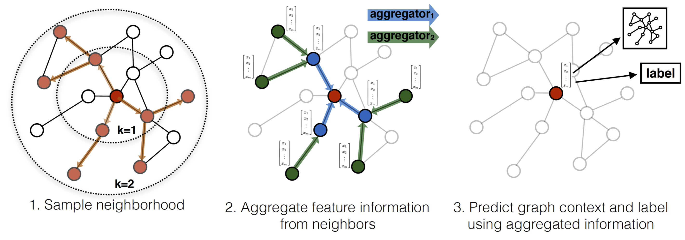

# Transfer Learning with Global Satellite Data to Predict Localised Nitrogen Dioxide Levels

This repository contains the code and data for the project "Transfer Learning with Global Satellite Data to Predict Localised Nitrogen Dioxide Levels", submitted for my Master's Research Project for the University of Bristol, March 2023.

## Abstract

This report proposes a novel approach for predicting NO2 concentrations at unseen locations in Bristol using satellite air quality and meteorological data, with the ultimate goal of creating a ‘virtual sensor’ for areas with limited air quality monitoring resources. Our approach utilises the GraphSAGE framework for inductive learning on graphs, combining autoregression and transfer learning with data from London in order to improve performance on the limited data available in Bristol. The proposed method is shown to have a 17% reduction in Normalised Root Mean Squared Error (NRMSE) compared to current models when evaluated on the same dataset.

{alt="Actual vs predicted nitrogen dioxide values over a period of time at the Wells Road sensor in Bristol",caption="Actual vs predicted nitrogen dioxide values over a period of time for the Wells Road sensor in Bristol"}

## Files

The `graph_model.ipynb` notebook contains the code for training and evaluating the GraphSAGE model.

The `bristol_ground_sat_weather_new.feather` file contains the data for Bristol, including satellite air quality data, meteorological data, and NO2 concentration data from ground-based monitoring stations. The `london_ground_sat_weather.feather` file contains the data for London.

The `get_satellite_data.py` file contains the code for downloading the satellite air quality data from Google Earth Engine.

The `lat_long_to_location.pkl` file contains a mapping from latitude and longitude coordinates to locations.

The plots directory contains the plots that were generated for the project.

The `requirements.txt` file lists the Python packages that are required to run the code.

Any other files are not relevant for running the latest model.

### Instructions

To run the code, you will need to have Python installed. You can then install the dependencies by running the following command:

`pip install -r requirements.txt`

Once you have installed the dependencies, you can run the code by running all the cells in the `graph_model.ipynb` notebook.

This will load in the data, format it into a graph, then train the model and evaluate it on the test set.

### Additional Resources

The GraphSAGE framework for inductive learning on graphs: [GraphSAGE](https://snap.stanford.edu/graphsage/#:~:text=GraphSAGE%20is%20a%20framework%20for,Code)

## Contact

If you have any questions, please contact me at [finn.gueterbock@gmail.com](mailto:finn.gueterbock@gmail.com).

## Images

{alt="Scatter plots of the different models used in the project",caption="Scatter plots showing the accuracy of the different models used in the project. In this case, _transferred_ measn the model was first trained on London data then fine-tuned and tested on Bristol data."}

{alt="Sample and aggregation",caption="The GraphSAGE sample and aggregation process"}

